# RISC-V (RV32I) Cache Simulator

A cycle-accurate, configurable C++ cache memory hierarchy simulator designed for 32-bit RISC-V (RV32I) architectures. This simulator models interactions between the processor, cache controller, and main memory to evaluate cache hit/miss behavior, memory latency, and eviction dynamics.

---

## 📌 Architecture & Design Overview

```
                        +----------------------------+
                        |      RISC-V CPU / Driver   |
                        +----------------------------+
                                      |
                         Address / Data Read / Write
                                      |
                                      v
                        +----------------------------+
                        |       L1 Data Cache        |
                        |   (2-Way Set-Associative)  |
                        |   - Write-Back / Dirty Bit |
                        |   - LRU Replacement Policy |
                        +----------------------------+
                                      |
                             Miss / Line Eviction
                                      |
                                      v
                        +----------------------------+
                        |        Main Memory         |
                        |  (64 KB Data + Instr Mem)  |
                        +----------------------------+
```

### 32-Bit Address Decomposition (Default Configuration)
Under the current configuration in [`include/CacheConfig.h`](include/CacheConfig.h), 32-bit addresses are decomposed as follows:

| Field | Bit Range | Size (Bits) | Description |
| :--- | :--- | :--- | :--- |
| **Tag** | `[31:9]` | **23 bits** | Identifies the specific memory block within the set |
| **Index** | `[8:4]` | **5 bits** | Selects one of the 32 cache sets ($\log_2(32) = 5$) |
| **Offset** | `[3:0]` | **4 bits** | Selects byte within the 16-byte block ($\log_2(16) = 4$) |

$$\text{Total Address Bits} = 23 \ (\text{Tag}) + 5 \ (\text{Index}) + 4 \ (\text{Offset}) = 32 \text{ bits}$$

---

## ⚙️ Cache Configuration Specifications

The simulator's parameters are defined at compile time in [`include/CacheConfig.h`](include/CacheConfig.h):

| Parameter | Value | Calculation / Formula |
| :--- | :--- | :--- |
| **Total Cache Size** (`CACHE_SIZE`) | `1024 bytes` (1 KB) | Defined capacity |
| **Block / Line Size** (`BLOCK_SIZE`) | `16 bytes` | Cache line granularity |
| **Associativity** (`ASSOCIATIVITY`) | `2` | 2-Way Set-Associative |
| **Total Blocks** (`NUM_BLOCKS`) | `64 blocks` | $\text{CACHE\_SIZE} / \text{BLOCK\_SIZE}$ |
| **Total Sets** (`NUM_SETS`) | `32 sets` | $\text{NUM\_BLOCKS} / \text{ASSOCIATIVITY}$ |
| **Offset Bits** (`NUM_OFFSET_BITS`) | `4 bits` | $\log_2(\text{BLOCK\_SIZE})$ |
| **Index Bits** (`NUM_INDEX_BITS`) | `5 bits` | $\log_2(\text{NUM\_SETS})$ |
| **Tag Bits** (`NUM_TAG_BITS`) | `23 bits` | $32 - (\text{NUM\_INDEX\_BITS} + \text{NUM\_OFFSET\_BITS})$ |

---

## 📂 Project Structure & File Index

```
CacheImplementation/
├── include/
│   ├── CacheConfig.h    # Cache geometry constants and bitfield compile-time asserts
│   ├── Cache.h          # CacheBlock, CacheSet, and Cache controller declarations
│   └── Memory.h         # Main memory interface (data & instruction memory)
├── src/
│   ├── Cache.cpp        # Cache access, eviction, and LRU replacement implementation
│   └── Memory.cpp       # Byte/Word load/store operations and program loading
├── .gitignore           # Git ignore patterns for binaries, traces, and IDE files
├── build.bat            # One-click Windows build script (MinGW-w64 GCC)
├── main.cpp             # Driver and testbench entry point
└── README.md            # Project documentation and specifications
```

### File Details
- **[`include/CacheConfig.h`](include/CacheConfig.h)**:
  Contains compile-time `constexpr` constants and `static_assert` checking bit balance ($23 + 5 + 4 = 32$).
- **[`include/Cache.h`](include/Cache.h)**:
  Declares `struct CacheBlock` (valid bit, dirty bit, tag, data array), `struct CacheSet` (associative ways and LRU counters), and the `Cache` class.
- **[`include/Memory.h`](include/Memory.h)** & **[`src/Memory.cpp`](src/Memory.cpp)**:
  Implements a 64 KB byte-addressable physical memory (`dataMem`) and instruction memory (`instrMem`) with little-endian word/byte access methods (`loadWord`, `storeWord`, `loadByte`, `storeByte`, `fetchInstruction`, `loadProgram`).
- **[`src/Cache.cpp`](src/Cache.cpp)**:
  Implements cache controller methods: tag/index/offset address extraction, set-associative lookup (`findWay`), LRU way selection (`getLRUWay`), memory line fetching (`fetchBlock`), write-back evictions (`evictBlock`), and statistics reporting (`printStats`).
- **[`build.bat`](build.bat)**:
  Automated build script for MinGW-w64 with flags `-std=c++17 -Wall -Wextra -Iinclude`, error handling, interactive run prompts, and `clean` argument support.

---

## 🗺️ Implementation Status & Roadmap

```mermaid
flowchart LR
    subgraph Done [Completed]
        M1[Memory Model 64KB]
        M2[Cache Geometry Config]
        M3[Address Decomposition]
        M4[Set-Associative Tag Search]
        M5[Build System & Tooling]
    end

    subgraph Current [In Progress]
        C1[LRU Victim Selection]
        C2[Line Fetch & Dirty Eviction]
        C3[Load/Store Controller Logic]
        C4[Test Suite in main.cpp]
    end

    subgraph Future [Future Milestones]
        F1[Split L1I / L1D Caches]
        F2[Multi-Level L1/L2 Hierarchy]
        F3[Trace-Driven Simulation]
        F4[Full RV32I Core Integration]
    end

    Done --> Current --> Future
```



### ✅ Completed
- [x] 64 KB byte-addressable main memory with little-endian access (`Memory.h`, `Memory.cpp`).
- [x] Binary instruction file parser (`loadProgram`).
- [x] Configurable geometry header with compile-time assertions (`CacheConfig.h`).
- [x] Declaration of `CacheBlock`, `CacheSet`, LRU state, and `Cache` controller (`Cache.h`).
- [x] Address decomposition methods: `getTag()`, `getIndex()`, `getOffset()` (`Cache.cpp`).
- [x] Set-associative tag lookup and hit/miss detection: `findWay()` (`Cache.cpp`).
- [x] Windows one-click compilation script (`build.bat`) with `clean` and `run` commands.
- [x] Repository `.gitignore` configured for C++ build artifacts, traces, and IDE files.

### 🔄 In Progress
- [ ] Complete `Cache` controller methods in `src/Cache.cpp`:
  - `getLRUWay()`: Find empty line or identify LRU victim way based on counters.
  - `updateLRU()`: Update LRU status/rank upon access.
  - `fetchBlock()`: Fetch 16-byte block from `Memory` on read/write miss.
  - `evictBlock()`: Write dirty blocks back to `Memory` on replacement.
  - `loadWord()`, `loadByte()`, `storeWord()`, `storeByte()` with write-back policy.
  - `printStats()`: Hit count, miss count, hit rate (%), and miss rate (%).
- [ ] Test harness in `main.cpp` demonstrating:
  - Sequential reads / spatial locality verification.
  - Repeated reads / temporal locality verification.
  - Conflict misses & LRU line replacement behavior.
  - Dirty line write-back verification to `Memory`.

### 🚀 Future Milestones
- [ ] **Configurable Replacement Policies**: Runtime selection of LRU, FIFO, Random, and LFU.
- [ ] **Configurable Write Policies**: Write-Through + No-Write-Allocate vs. Write-Back + Write-Allocate.
- [ ] **Split L1 Caches**: Separate L1 Instruction Cache (L1I) and L1 Data Cache (L1D).
- [ ] **Multi-Level Hierarchy (L1 + L2)**: Inclusive/exclusive L2 unified cache with custom latency modeling.
- [ ] **Detailed Metrics & Profiling**: AMAT (Average Memory Access Time) and 3C Miss classification (Compulsory, Capacity, Conflict).
- [ ] **Trace-Driven Simulation**: Support for memory trace files (Dinero IV / Valgrind traces).
- [ ] **Pipelined RV32I CPU Interfacing**: Direct connection to an execute/memory stage of a RISC-V simulator.

---

## 🛠️ Building & Running

### Prerequisites
- **Compiler**: GCC / MinGW-w64 with C++17 support (`g++`).

### Build using Batch Script (Windows)
- **One-Click**: Double-click [`build.bat`](build.bat) in Windows Explorer.
- **Compile via Command Prompt / PowerShell**:
  ```cmd
  build.bat
  ```
- **Compile and Run immediately**:
  ```cmd
  build.bat run
  ```
- **Clean output files**:
  ```cmd
  build.bat clean
  ```

### Manual Compilation
```cmd
g++ -std=c++17 -Wall -Wextra -Iinclude main.cpp src/*.cpp -o bin\cache_sim.exe
bin\cache_sim.exe
```