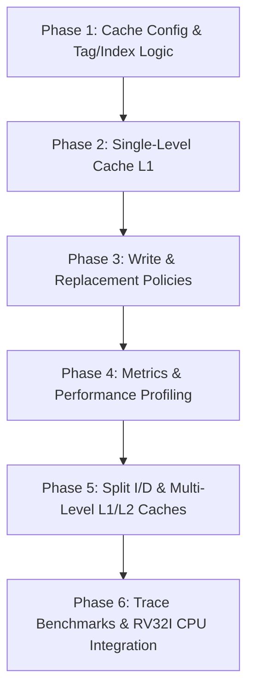

# RISC-V (RV32I) Cache Simulator

A cycle-accurate, configurable C++ cache memory hierarchy simulator designed for 32-bit RISC-V (RV32I) architectures. This project models the interaction between the CPU, L1/L2 caches, and main memory to evaluate cache hit/miss behavior, memory latency, and performance metrics.

---

## 📌 Project Overview

Modern processors rely heavily on cache hierarchies to bridge the processor-memory performance gap. This project provides a modular and extensible framework to simulate various cache architectures, replacement strategies, and write policies using realistic memory access traces and RV32I program execution.

---

## 🏗️ Current Implementation

- **Main Memory Subsystem (`Memory.h` / `Memory.cpp`)**:
  - 64 KB byte-addressable data memory model.
  - Instruction memory loader capable of parsing binary machine code files.
  - Word (`32-bit`) and Byte (`8-bit`) aligned load/store access methods with boundary checks.
- **Build & Development Tooling**:
  - One-click Windows build script (`build.bat`) supporting MinGW-w64 GCC (`C++17`).
  - Automated binary packaging in `bin/` with integrated execution and cleanup commands.

---

## 🗺️ Roadmap & Implementation Plan



### Phase 1: Core Cache Architecture & Addressing
- [ ] Define `CacheConfig` struct (Cache Size, Block/Line Size, Associativity).
- [ ] Implement address splitting logic:
  - **Offset bits**: $\log_2(\text{Block Size})$
  - **Index bits**: $\log_2(\text{Number of Sets})$
  - **Tag bits**: $32 - (\text{Index bits} + \text{Offset bits})$
- [ ] Construct Cache Line structures (Valid bit, Dirty bit, Tag, Data block, Replacement metadata).

### Phase 2: Associativity & Mapping Modes
- [ ] **Direct-Mapped Cache** (1 line per set).
- [ ] **$N$-Way Set-Associative Cache** ($2, 4, 8, 16$-way).
- [ ] **Fully Associative Cache** with associative search.

### Phase 3: Replacement & Write Policies
- [ ] **Replacement Policies**:
  - [ ] **LRU** (Least Recently Used) via timestamp / access counters.
  - [ ] **FIFO** (First-In, First-Out).
  - [ ] **Random** replacement.
  - [ ] **LFU** (Least Frequently Used).
- [ ] **Write Policies**:
  - [ ] **Write-Through** with No-Write-Allocate.
  - [ ] **Write-Back** with Write-Allocate (tracking dirty line write-backs to `Memory`).

### Phase 4: Performance Metrics & Analysis Engine
- [ ] Track detailed statistics per simulation run:
  - Total Accesses, Read/Write Hit & Miss counts.
  - Hit Rate and Miss Rate (%).
  - **3C Miss Breakdown**: Compulsory (Cold), Capacity, and Conflict misses.
  - **AMAT** (Average Memory Access Time) calculation based on configurable cycle latencies:
    $$\text{AMAT} = \text{Hit Time} + (\text{Miss Rate} \times \text{Miss Penalty})$$

---

## 🚀 Future Implementations & Advanced Features

- [ ] **Split L1 Caches**: Dedicated Instruction Cache (L1I) and Data Cache (L1D).
- [ ] **Multi-Level Cache Hierarchy (L1 + L2)**: Inclusive and Exclusive multi-level cache simulations.
- [ ] **Victim Cache / Prefetcher**: Simulation of Stream Buffers and next-line prefetching.
- [ ] **Trace-Driven Simulation**: Support for standard memory trace formats (e.g., Dinero trace format / Valgrind memory traces).
- [ ] **Full RV32I Core Interfacing**: Connect cache directly to an execution stage of a pipelined RISC-V CPU core.

---

## 📂 Project Structure

```
CacheImplementation/
├── bin/                 # Compiled executable binaries (generated)
├── include/             # Header files
│   ├── Cache.h          # Cache controller and line declarations
│   ├── CacheConfig.h    # Cache configuration parameters and structs
│   └── Memory.h         # Main memory interface
├── src/                 # Implementation files
│   ├── Cache.cpp        # Cache logic and replacement algorithms
│   └── Memory.cpp       # Main memory implementation
├── .gitignore           # Git ignore rules
├── build.bat            # One-click build script for Windows (MinGW g++)
├── main.cpp             # Simulation entry point and driver
└── README.md            # Project documentation and roadmap
```

---

## ⚙️ Building and Running

### Prerequisites
- **Compiler**: GCC / MinGW-w64 with C++17 support (`g++`).

### Build using Batch Script (Windows)
- **One-Click**: Double-click [`build.bat`](build.bat) from Windows File Explorer.
- **Terminal (Build)**:
  ```cmd
  build.bat
  ```
- **Terminal (Build and Run)**:
  ```cmd
  build.bat run
  ```
- **Clean Build Artifacts**:
  ```cmd
  build.bat clean
  ```